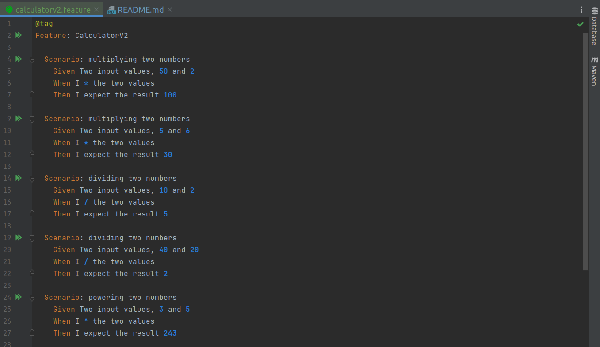
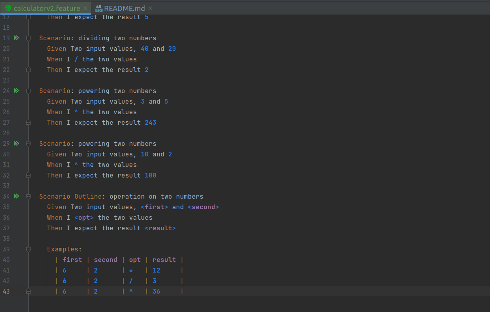
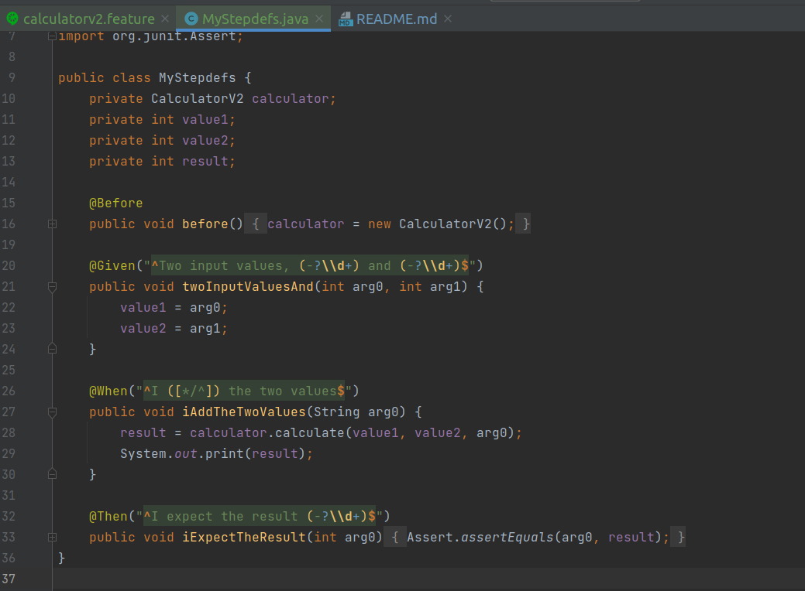
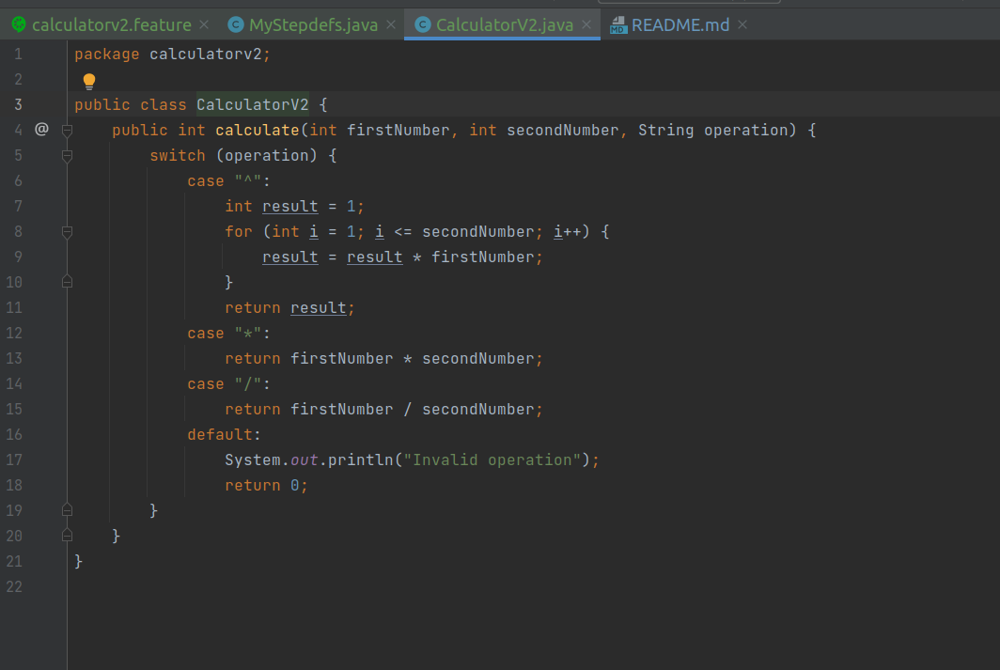
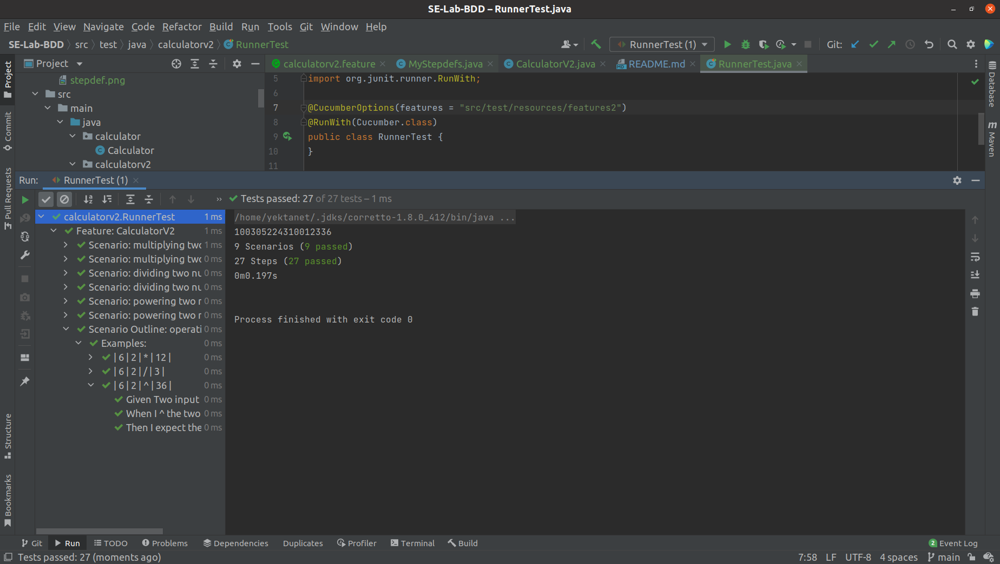

# SE-Lab-BDD

<div dir="rtl">
2. تست دوم با ورودی‌های زیر به مشکل می‌خورد:
</div>
| -1 | 6 | 5 |

<div dir="rtl">
این مشکل به دلیل عدم تطبیق مقادیر ورودی با regex نوشته شده در MyStepdefs است.
</div>

```java
@Given("^Two input values, (-?\\d+) and (-?\\d+)$")

@Then("^I expect the result (-?\\d+)$")
```

<div dir="rtl">
این regex اعداد منفی را به عنوان ورودی قبول نمی‌کند. 
برای حل این مشکل صرفا کافیست  تغییر زیر را بدهیم تا اعداد منفی نیز تشخیص داده شوند.
</div>

```(\\d+)``` ==>  ```(-?\\d+)```

---

3. ابتدا سناریوی تست‌ها را می‌نویسیم:




سپس با توجه به سناریوهای نوشته شده MyStepdefs را تعریف می‌کنیم:



حال که تست‌ها را نوشتیم، کد برنامه‌ی ماشین‌حساب را پیاده‌سازی می‌کنیم:



حال تست‌های برنامه را اجرا می‌کنیم تا صحت عملکرد آن را بررسی کنیم:


